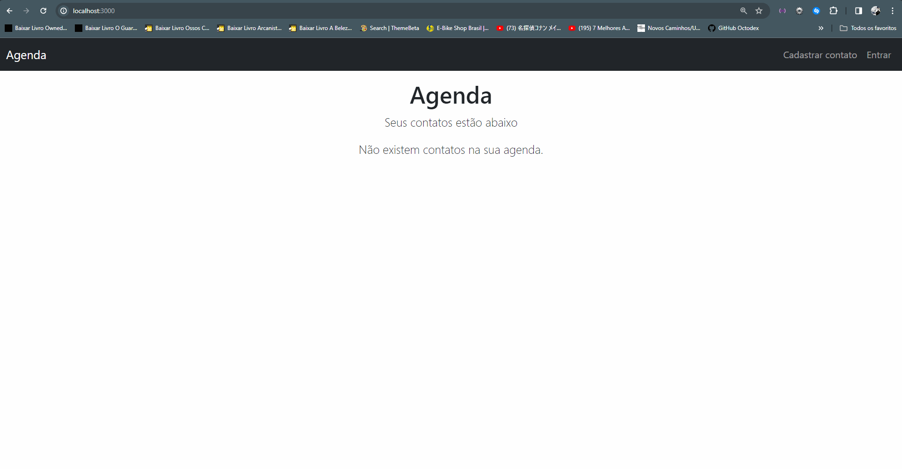

# Aplicação de uma Agenda

Uma aplicação web com back-end e front-end, tem como finalidade armazenar os contatos de uma pessoa.

### Comandos
 * npm start -> executa o nodemon
 * npm run dev -> executa o webpack
 * npm test -> executa os testes

## Tecnologias

## Agenda

